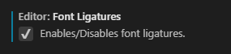

# 1.1. Einrichtung VSCode

Grundsätzlich wird zum Webentwicklung bei uns mit [Visual Studio Code](https://code.visualstudio.com/) gearbeitet.

## Visual Studio Code

### Programmierschriftart mit Ligaturen

Es empfiehlt sich, eine Schriftart mit Programmier-Ligaturen zu verwenden. Wir greifen dazu bei uns auf "[Fira Code](https://github.com/tonsky/FiraCode)" zurück.

Dazu sind folgende Schritte in Visual Studio Code notwendig:

**File -&gt; Preferences -&gt; Settings**

### **Nützliche Plugins**

| Tool | Beschreibung |
| :---: | :---: |
|  | **Einstiegstools** |
| Bracket Pair Colorizer 2 | Farbiges Markieren zusammengehöriger Klammernpaare |
| GitLens - Git supercharged | Bessere Übersicht über das aktuelle Git-Repository, besseres Tracking der Änderungen am Git-Repo |
| Live Server | Schneller Webserver, um sich eine kurzfristige Entwicklungsumgebung zu schaffen |
| Prettier - Code formatter | Automatisches Formatieren und Anpassen des Codes \(vorallem JavaScript\) beim Speichern |
|  | **Spezielle Tools** |
| PHP Intelephense | Automatische Codeformatierung für PHP, besseres Syntax-Highlighting, bessere Suche in PHP-Quellcode |
| npm Intellisense | Bessere Codevorschläge beim Arbeiten mit nodejs |
| Vetur | Bessere Interpretation von .vue Dateien |

\*\*\*\*

